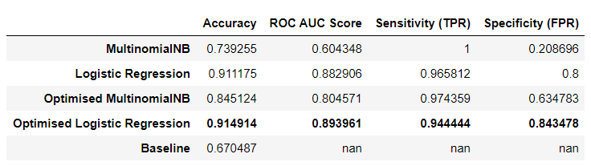
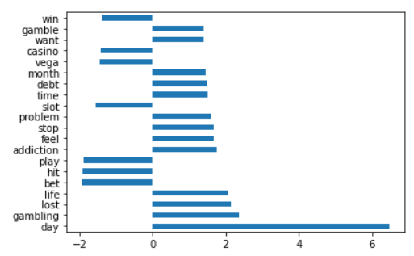

# Project 3 README File
**Shaun Chua**
 12 March 2020
 DSI-13

---------------------------------------------------------------------------------

## Problem Statement
**Context**
It is evident that problem gambling <a href="https://www.straitstimes.com/singapore/more-seek-help-for-gambling-problems">continues to exist</a> in Singapore, with illegal gambling persisting even <a href="https://www.straitstimes.com/singapore/police-arrest-37-people-seized-more-than-3000-in-illegal-gambling-prostitution-sting">in recent times</a>.

As the <a href="https://www.ncpg.org.sg/en/Pages/Home.aspx">National Council on problem Gambling</a> (NCG) continues to combat problem gambling, finding a method to distinguish between gambling and problem gambling may prove useful.

To this end, our project aims to develop a model that will assist in identifying individuals heading towards problem gambling, or are already facing problem gambling.

**Project Goals**
The goal of this project is two-fold:
  (1) Utilise Reddit's Application Programming Interface (API) to collect posts from **two** subreddits
(2) Utilise Natural Language Processsing (NLP) to train **at least two** models which can be used to classify posts based on which of the two subreddits it came from.

The two subreddits I will be using are <a href="https://www.reddit.com/r/problemgambling/">**r/problemgambling**</a> and <a href="https://www.reddit.com/r/gambling/">**r/gambling**</a>.

**Models Utilised**
The **Multinomial Naive Bayes Model** and **Logistic Regression Model** will be used.

**Classification Metrics**
Several classification metrics will be considered, and these include:
  1) Accuracy
2) Sensitivity
3) Specificity
4) ROC_AUC Score

We will pay special attention to **Sensitivity** because we feel that it is more important to correctly identify a problem gambler, as opposed to correctly identifying a non-problem gambler (specificity).

**Application**
The findings of this project may provide insight which caters to **two main stakeholder groups**.

First, to the NCPG Management, and second, to the NCPG Data Science Team.

I believe that the findings of this project, in particular the keywords that tend to distinguish between gambling and problem gambling, will aid in identifiying Singaporeans headed towards, or are currently facing, problem gambling.

# Executive Summary
### 1. Methodology

This project utilised reddit's Application Programming Interface (API) to scrape posts from two subreddits, r/problemgambling and r/gambling, and saved all posts into a separate CSV file for each subreddit.

#### 1.1 Data Cleaning
We then combined the two CSV files and begun cleaning the data in approximiately the following order:
1) Feature column selection (`subreddit`, `selftext`, and `title`)
  2) Dropping duplicates (likely to be reposts)
3) Resolving/Imputation for missing values of `subreddit`, `selftext`, and `title`
4) Mapping both subreddits, `1: problemgambling` and `0: gambling`
5) Cleaning posts (tokenisation, stopword removal, lemmetisation)

#### 1.2 Modelling
We opted to utilise Term Frequency-Inverse Document Frequency (TFIDF) Vectorisation to account for discrimination bewteen posts.

As for modelling, we first performed a **stratified train-test split**.  We then selected the Multinomial Naive Bayes and Logistic Regression for an initial run. Both models were then optimised via GridSearchCV to obtain best parameters, and were ran again.

### 2. Findings
Overall, the optimised versions of the models ran performed better as suggested by the chosen classification metrics.

The **Optimised Multinomial Naive Bayes** showed the greatest sensitivity, at the cost of specificity.

Meanwhile, the **Optimised Logistic Regression** showed a slightly lower sensitivity score as compared to the **Optimised Multinomial Naive Bayes**, but gave a significantly higher specificity score.

The table below shows the various classification metrics scores for each run of the models:

## 3. Discussion
**Model Selection**
We decided to adopt the Optimised Logistic Regression, in favour of the lower tradeoff for specificity despite the lower sensitivity score.

**Feature Words**
The bar plot below shows the coefficients of the top 20 feature words obtain from the model. Evidently, certain words tended to lead the model to classify a post as originating from r/problemgambling and others from r/gambling.

  In the evaluation of the model, words like `debt`, `addiction`, and `lost`, often led it to classify a post as one originating from **r/problemgambling**.

In contrast, words like `casino`, `play`, and `bet`, often led the model to classify a post as one originating from **r/gambling**.

## 4. Conclusion and Recommendations

#### Basis of Recommendations
We believe that our model is able to classify posts correctly to a large extent (ROC Score: 0.898, TPR: 94%), based on feature words (some more so than others). Therefore, we can **use these features words as a basis upon which to provide recommendations** to two distinct audiences.

####  Primary Audience Recommendations: NCPG Management 
Recommendations for the NCPG can be split broadly into two categories:
 (1) Early Intervention
(2) Post Intervention

##### Early Intervention
Feature words can be used by NCPG personnel to identify individuals who are at risk of developing debilitative gambling habits.

Feature words can be incorporated into a variety of exisiting or potential means as a form of problem gambling identification. These methods may include but are not limited to:
  **1) Consultations**
**2) Surveys**

Appropriate follow up action can then be considered, but this is **beyond the scope of our project**.

##### Post Intervention
The underlying principle remains the same for post-intervention recommendations - capitalise on feature words to identify whether an individual is recovering from or regressing to problem gambling.

####  Secondary Audience Recommendations: NCPG Data Science Team 
The findings of our project may assist the current data science team at the NCPG by providing a set of feature words, which may then be utilised to propel any current endeavours.

Further, the team will have access to our model, which they can choose to utilise.

## 5. Limitations
####  Generalisability: Context 
At the crux of project lies the assumption that posts from Reddit will generalise to the Singaporean context. In reality, this can be no further from the truth.

As of 2019 October, <a href="https://www.statista.com/statistics/325144/reddit-global-active-user-distribution/">about half</a> of visitors to Reddit are American, which suggests that posts will more likely reflect the American context instead of the Singaporean context.

####  Generalisability: Gender 
<a href="https://mediakix.com/blog/reddit-statistics-users-demographics/">About 70%</a> of Redditors are male, which hints that the actual female experience may not be reflected by posts on Reddit. We assumed that the majority of problem gamlers are male.

## 6. Future Directions
####  Areas for Study 
Our projected looked at scrapped Reddit posts from two subreddits, r/problemgambling and r/gambling. We then used NLP to process these posts in order to train a model to classify them correctly. Ultimately, we wanted to be able to create a model to help identify individuals heading towards or are currently experiencing problem gambling.

One possible area of interest that awaits further study is the a potential follow-up to our project. While we aimed to identify current/potential problem gamblers, future studies can target recovering problem gamblers. In particular, investigating recovering and regressing problem gamblers.

####  Generalisability: Context 
To address the issue of generalisability to the Singaporean context, we recommend considering Singaporean oriented forums such as HardwareZone.

####  Generalisability: Gender 
On hindsight, there may not be a great impact of this assumption for the Singaporean context. It could be the case that the majority of problem gamblers are indeed male. However, it may be worth checking whether this is indeed the case by searching the records of the NPCG.
